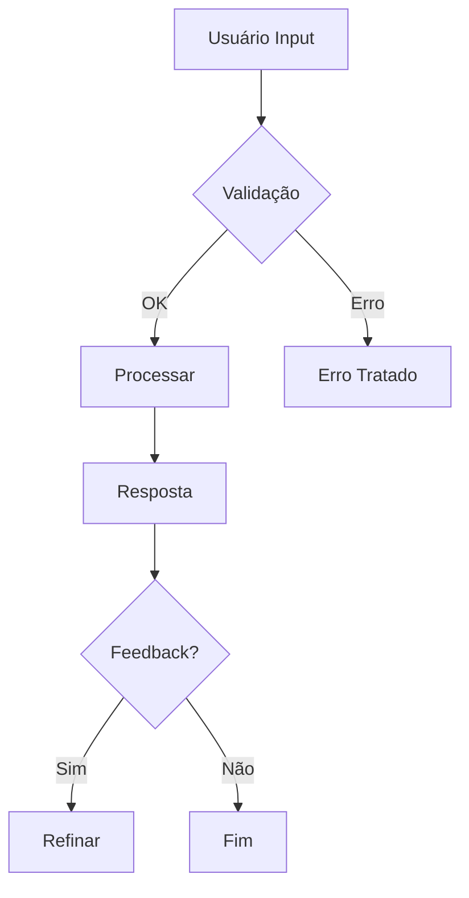

# 🧠 AI Reusables Framework
**Engenharia Modular de IA — Código, Design e Conhecimento Reutilizáveis**

[](https://www.python.org/)
[](LICENSE)
[](DOC/)
[]()

---

## 📋 Visão Geral

**AI Reusables Framework** é um sistema modular de engenharia de IA que unifica:

- **🏗️ Engenharia técnica** — Templates arquiteturais, prompts modulares, adaptadores
- **🎨 Design de experiência** — Mapas de jornada, fluxos de interação, guardrails
- **📦 Gestão de conhecimento** — Repositório de ativos reutilizáveis, documentação viva
- **⚙️ DevOps & MLOps** — Versionamento, containerização, rastreabilidade

Objetivo: **iniciar, versionar e expandir qualquer projeto de IA com máximo reuso de código, prompts e design**.

---

## 🗂️ Estrutura de Diretórios

```
AI_Reusables_Framework/
│
├── 📁 core_engineering/              # Espinha dorsal técnica
│   ├── skin_struct/                  # Templates arquiteturais (RAG, classifier, generator)
│   ├── prompt_modular/               # Módulos de prompt e contexto
│   ├── scheme_traductor/             # Adaptadores e conversores de formato
│   └── technology_stack/             # Ambientes, Docker, dependências
│
├── 📁 core_design/                   # Experiência e interação
│   ├── experience_maps/              # Jornadas de usuário, mapas de empatia
│   ├── components/                   # Diagramas Mermaid de fluxo
│   └── doc.md                        # Guia de design patterns
│
├── 📁 core_management/               # Repositório de ativos
│   ├── reusable_projects/
│   │   ├── snippets/                 # Trechos reutilizáveis
│   │   ├── equations/                # Modelos e fórmulas
│   │   ├── assets/                   # Recursos compartilhados
│   │   └── case_studies/             # Estudos de caso (RAG, classifier, generator)
│   └── versioning_policy.md
│
├── 📁 DOC/                           # Base de conhecimento
│   ├── index.md
│   ├── use_cases.md
│   ├── api_reference.md
│   ├── dependencies.md
│   └── limitations.md
│
├── 📁 examples/                      # Projetos de demonstração
│   ├── rag_medical/
│   ├── classifier_news/
│   └── generator_poetry/
│
├── README.md                         # Este arquivo
├── mkdocs.yml                        # Configuração da documentação
└── LICENSE

```

---

## 🚀 Início Rápido

### 1️⃣ **Clone o Repositório**
```bash
git clone https://github.com/seu-usuario/AI_Reusables_Framework.git
cd AI_Reusables_Framework
```

### 2️⃣ **Configure o Ambiente**
```bash
# Usando Conda
conda env create -f core_engineering/technology_stack/conda.yaml
conda activate ai-reusables

# Ou usando pip
pip install -r core_engineering/technology_stack/requirements.txt
```

### 3️⃣ **Explore a Documentação**
```bash
# Gere a documentação com MkDocs
mkdocs serve

# Abra http://localhost:8000 no navegador
```

### 4️⃣ **Execute um Exemplo**
```bash
cd examples/rag_medical
python app.py
```

---

## 🧩 Componentes Principais

### **Pilar 1: Engenharia (`core_engineering/`)**

#### 🏗️ **skin_struct/** — Templates Arquiteturais
Estruturas prontas para diferentes tipos de aplicações:

| Template | Uso | Componentes |
|----------|-----|-------------|
| `rag_template/` | Retrieval-Augmented Generation | ingestion → retrieval → serving → app |
| `classifier_template/` | Classificação de texto/dados | preprocessing → model → prediction → output |
| `generator_template/` | Geração de conteúdo | context → generation → post-processing → delivery |

**Uso:**
```python
from core_engineering.skin_struct import RAGTemplate

rag = RAGTemplate(config='config.yaml')
rag.ingest(documents='data/docs')
result = rag.query('Qual é o tratamento?')
```

#### 🧠 **prompt_modular/** — Prompts Dinâmicos
Combine módulos de persona, formato e raciocínio:

```python
from core_engineering.prompt_modular import PromptBuilder

prompt = PromptBuilder()
prompt.add('persona/expert.yaml')
prompt.add('format/json_output.yaml')
prompt.add('reasoning/SoT_generic.yaml')

system_prompt = prompt.build()
response = client.chat.completions.create(
    system=system_prompt,
    messages=[...]
)
```

#### 🔄 **scheme_traductor/** — Adaptadores
Converta entre formatos e idiomas:

```python
from core_engineering.scheme_traductor import SchemeAdapter

adapter = SchemeAdapter()
translated = adapter.translate(text='Hello', target_lang='pt')
mapped = adapter.map_schema(output, source='api', target='app_format')
```

#### ⚙️ **technology_stack/** — Ambiente Reproduzível
```bash
# Build Docker
docker-compose -f core_engineering/technology_stack/docker-compose.yaml up

# Track com DVC
dvc add models/my_model.pkl
dvc push
```

---

### **Pilar 2: Design (`core_design/`)**

#### 🎨 **experience_maps/** — Jornada do Usuário
```yaml
# ai_journey_template.yaml
stages:
  - name: "Discovery"
    user_goal: "Entender capacidades da IA"
    ai_action: "Apresentar casos de uso"
    feedback_point: "Sentimento de valor?"
  
  - name: "Interaction"
    user_goal: "Obter resposta precisa"
    ai_action: "Processar input e gerar output"
    feedback_point: "Qualidade da resposta?"
```

#### 📊 **components/** — Fluxos Visuais


---

### **Pilar 3: Gestão (`core_management/`)**

#### 📦 **reusable_projects/** — Seu Estoque de Ativos

**Cada ativo segue este padrão:**
```
snippets/
├── name_of_snippet.py
├── README.md                # Descrição + exemplo + limitações
└── test_snippet.py

equations/
├── attention_mechanism.md   # Documentado com LaTeX
└── reference.bib
```

**Exemplo de uso:**
```python
from core_management.reusable_projects.snippets import embedder_dense

embeddings = embedder_dense(texts, model='all-MiniLM-L6-v2')
```

#### 📚 **DOC/** — Documentação Centralizada
- **index.md** — Mapa de navegação
- **use_cases.md** — Quando usar cada template
- **api_reference.md** — Referência completa de APIs
- **dependencies.md** — Stack completo
- **limitations.md** — Restrições e trade-offs

---

## 🔄 Fluxo de Trabalho Recomendado

```
1. 📘 Consultar DOC/use_cases.md
   ↓
2. 📦 Selecionar template em core_engineering/skin_struct/
   ↓
3. 🧠 Montar prompts em core_engineering/prompt_modular/
   ↓
4. 🎨 Validar UX em core_design/experience_maps/
   ↓
5. ⚙️ Deploy com core_engineering/technology_stack/
   ↓
6. 📊 Registrar em MLflow/DVC para rastreabilidade
```

---

## 📝 Exemplos de Uso

### Exemplo 1: RAG Médico
```bash
cd examples/rag_medical
python app.py --query "Qual é o tratamento para pneumonia?"
```

### Exemplo 2: Classificador de Notícias
```bash
cd examples/classifier_news
python train.py --dataset news_dataset
python predict.py --text "Dólar bate recorde"
```

### Exemplo 3: Gerador de Poesia
```bash
cd examples/generator_poetry
python generate.py --style "Modernismo" --theme "Amor"
```

---

## 🛠️ Instalação Completa

### Requisitos
- Python 3.10+
- Docker & Docker Compose (opcional)
- Git
- Conda (recomendado)

### Passos

1. **Clone:**
```bash
git clone https://github.com/seu-usuario/AI_Reusables_Framework.git
cd AI_Reusables_Framework
```

2. **Ambiente Conda:**
```bash
conda env create -f core_engineering/technology_stack/conda.yaml
conda activate ai-reusables
```

3. **Instale dependências locais:**
```bash
pip install -e .
```

4. **Configure variáveis de ambiente:**
```bash
cp .env.example .env
# Edite .env com suas chaves de API
```

5. **Execute testes:**
```bash
pytest core_engineering/tests/
```

---

## 📖 Documentação Detalhada

### Gerado com MkDocs

```bash
mkdocs serve
```

Abra: **http://localhost:8000**

Tópicos cobertos:
- ✅ Arquitetura geral
- ✅ API Reference completa
- ✅ Guia de templates
- ✅ Best practices
- ✅ Troubleshooting

---

## 🎯 Casos de Uso

### ✅ Quando usar este framework:

- Você cria **múltiplos projetos de IA** e quer reutilizar código
- Precisa de **reproducibilidade** e **versionamento**
- Quer manter **prompts organizados e modulares**
- Necessita de **templates prontos** (RAG, classifier, generator)
- Busca **documentação centralizada** e viva
- Trabalha em **equipe** e precisa de padrões claros

### ❌ Quando **não** usar:

- Prototipagem rápida (use Jupyter notebooks direto)
- Projetos muito simples (um único script)
- Frameworks específicos (LangChain, LlamaIndex já resolvem)

---

## 🤝 Contribuindo

Contribuições são bem-vindas! Siga estes passos:

1. Fork o repositório
2. Crie uma branch (`git checkout -b feature/nova-feature`)
3. Commit suas mudanças (`git commit -am 'Add new feature'`)
4. Push para a branch (`git push origin feature/nova-feature`)
5. Abra um Pull Request

**Diretrizes:**
- Siga [PEP 8](https://www.python.org/dev/peps/pep-0008/) para código Python
- Adicione testes para novas funcionalidades
- Atualize documentação em `DOC/`
- Cada novo ativo deve incluir README.md próprio

---

## 📋 Roadmap

- [ ] **v0.2** — Templates para Fine-tuning
- [ ] **v0.3** — Integração com Hugging Face Hub
- [ ] **v0.4** — Dashboard MLflow integrado
- [ ] **v0.5** — CLI tool para scaffolding de projetos
- [ ] **v1.0** — Release estável com cobertura de testes 100%

---

## 📄 Licença

Este projeto está sob licença [MIT](LICENSE). Veja o arquivo LICENSE para detalhes.

---

## 👨‍💻 Autor

**Desenvolvido por:** [Seu Nome / Seu GitHub]

**Contato:**
- GitHub: [@seu-usuario](https://github.com/seu-usuario)
- Email: seu-email@example.com
- Website: [seu-site.com](https://seu-site.com)

---

## 🙏 Agradecimentos

Este framework foi inspirado por:
- Principles of [Modular Design](https://en.wikipedia.org/wiki/Modular_design)
- Best practices de [LangChain](https://github.com/langchain-ai/langchain)
- Architecture patterns de [FastAPI](https://fastapi.tiangolo.com/)
- Semantic engineering principles

---

## 📞 Suporte

Encontrou um problema? Abra uma [Issue](https://github.com/seu-usuario/AI_Reusables_Framework/issues).

Perguntas? Consulte a [Documentação](DOC/) ou [Discussions](https://github.com/seu-usuario/AI_Reusables_Framework/discussions).

---

## 🔗 Links Úteis

- 📚 [Documentação Completa](DOC/)
- 🎯 [Use Cases](DOC/use_cases.md)
- 🔧 [API Reference](DOC/api_reference.md)
- 📦 [Dependencies](DOC/dependencies.md)
- ⚠️ [Limitations](DOC/limitations.md)
- 💾 [DVC & MLflow Guide](core_engineering/technology_stack/)

---

**Versão:** 0.1.0 | **Última atualização:** 2025-11-10 | **Status:** 🟢 Em desenvolvimento ativo

---

> **Nota:** Este é o ponto de partida. Customize de acordo com seu contexto, adicione badges específicas, links para organizações, e integre com seus serviços reais (GitHub, ReadTheDocs, etc.).
