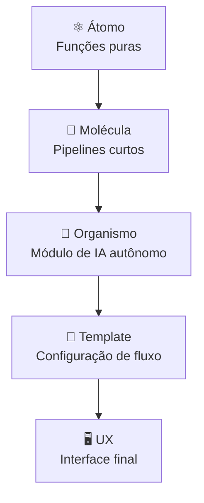

# ⚛️ Arquitetura Atômica (Atomic Architecture)

> “Do simples nasce o complexo. Toda experiência cognitiva é a combinação de pequenos comportamentos reutilizáveis.”  
> — *Manifesto da Engenharia Modular de IA*

---

## 📖 Descrição

A **Arquitetura Atômica** organiza sistemas de IA em **unidades mínimas e independentes**, chamadas **átomos** — funções, operadores ou módulos básicos que representam o comportamento elementar de um sistema cognitivo.

Cada átomo é projetado para ser **puro, testável e recombinável**, formando estruturas cada vez mais complexas:
- **Moléculas** → composições coesas de átomos  
- **Organismos** → módulos autônomos de IA  
- **Templates** → estruturas completas de fluxo  
- **Páginas/UX** → experiências de interação humana  

Essa abordagem se inspira na biologia (átomos → moléculas → organismos) e no *Atomic Design* (Brad Frost), aplicando o mesmo princípio à **engenharia modular de IA**.

---

## 🧩 Estrutura de Pastas (Modelo)

```plaintext
atomic_architecture/
│
├── atomic/                       # Unidades fundamentais
│   ├── text_ops.py                # Normalização, parsing, tokenização
│   ├── math_ops.py                # Similaridade, métricas, normalização
│   ├── data_ops.py                # I/O, limpeza, validação
│   └── README.md
│
├── molecular/                    # Combinações funcionais
│   ├── preprocess_pipeline.py
│   ├── embeddings_pipeline.py
│   ├── validation_chain.py
│   └── README.md
│
├── organismic/                   # Módulos autônomos de IA
│   ├── rag_agent.py
│   ├── classifier_agent.py
│   └── generator_agent.py
│
├── templates/                    # Fluxos de composição
│   ├── rag_template.yaml
│   ├── generator_template.yaml
│   └── classifier_template.yaml
│
└── ux/                           # Interfaces e experiência final
    ├── cli.py
    ├── api.py
    └── chatbot_ui.py
````

> Cada pasta representa um **nível de complexidade evolutiva**.
> O sistema cresce **horizontalmente**, através de recombinação — e não empilhamento hierárquico.

---

## ⚙️ Tipo de Arquitetura

**Paradigma:** Composicional / Modular Evolutiva
**Organização:** Horizontal (em fatias cognitivas)
**Dependência:** Unidirecional — átomos não conhecem moléculas
**Reuso:** Máximo (funções puras, independentes de contexto)
**Base Filosófica:** Biologia Sistêmica + Atomic Design

---

## 🧠 Casos de Uso Recomendados

| Cenário                              | Aplicação                                               | Benefício                              |
| ------------------------------------ | ------------------------------------------------------- | -------------------------------------- |
| Frameworks de IA modulares           | Construção incremental e reuso de operadores cognitivos | Reduz retrabalho e acoplamento         |
| Laboratórios de experimentação (I+D) | Testes rápidos de comportamento (funções puras)         | Facilita depuração e comparação        |
| Multiagentes inteligentes            | Cada agente pode ser composto de átomos e moléculas     | Modularidade e recombinação adaptativa |
| Ferramentas Low-Code / Prompt-Driven | Composição lógica via templates YAML                    | Favorece automação e escalabilidade    |

---

## 🧰 Requisitos Técnicos

Requisitos mínimos para implementar o modelo:

```txt
# requirements.txt
python>=3.10
numpy>=1.25
pydantic>=2.5
fastapi>=0.110
uvicorn>=0.30
typer>=0.9
jinja2>=3.1
```

---

## 🎨 Design / UX Recomendado

O design da arquitetura atômica deve refletir **modularidade e transparência de fluxo**.
Cada camada é visualmente distinta, mas semanticamente conectada.



> O fluxo não é linear — moléculas e organismos podem ser reusados em diferentes templates.
> Essa flexibilidade é a essência da arquitetura atômica.

---

## 🧠 Prompt Base (Context Priming)

Cada nível da arquitetura pode ser acompanhado de um módulo de prompt que define seu papel cognitivo.
Exemplo de prompt base para o nível atômico:

```yaml
# atomic_prompt.yaml
persona: |
  Você é um "Átomo Cognitivo": um componente mínimo de um sistema de IA modular.
  Sua função é executar uma única transformação de forma pura e previsível.

format: |
  Retorne sempre resultados padronizados e autônomos, sem dependências externas.

reasoning: |
  Passo 1: Receba a entrada e valide o tipo.
  Passo 2: Aplique a transformação atômica.
  Passo 3: Retorne o resultado e registre metadados se necessário.
```

---

## 🧪 Exemplo de Implementação

```python
# atomic/text_ops.py
import re
from typing import List

def normalize_text(text: str) -> str:
    """Remove espaços duplos e normaliza pontuação."""
    text = re.sub(r'\s+', ' ', text.strip())
    return text

def tokenize_sentences(text: str) -> List[str]:
    """Divide texto em sentenças."""
    return re.split(r'(?<=[.!?]) +', text)
```

```python
# molecular/preprocess_pipeline.py
from atomic.text_ops import normalize_text, tokenize_sentences

def preprocess_text(text: str):
    normalized = normalize_text(text)
    sentences = tokenize_sentences(normalized)
    return {"normalized": normalized, "sentences": sentences}
```

> Aqui vemos o princípio fundamental:
> **as moléculas são compostas por átomos, e organismos por moléculas**.

---

## 🧩 Referências Cruzadas

| Arquitetura         | Relação                | Observação                                           |
| ------------------- | ---------------------- | ---------------------------------------------------- |
| `camadas.md`        | Contraponto estrutural | Enquanto “camadas” empilham, “átomos” se combinam.   |
| `celulas.md`        | Próxima evolução       | As células formam-se quando organismos colaboram.    |
| `microsserviços.md` | Aplicação prática      | Cada organismo pode ser publicado como microserviço. |
| `eventos.md`        | Comunicação            | Permite a troca de sinais entre organismos.          |

---

## 🪞 Filosofia

> “Não há complexidade que não possa ser decomposta em clareza.”
>
> A Arquitetura Atômica propõe que o **pensamento modular** é a ponte entre
> a engenharia técnica e a cognição estética.
>
> O código torna-se arte quando cada átomo é desenhado com propósito.

---

## 🧭 Resumo

| Elemento  | Papel            | Exemplo             |
| --------- | ---------------- | ------------------- |
| Átomo     | Função pura      | `normalize_text()`  |
| Molécula  | Pipeline coeso   | `preprocess_text()` |
| Organismo | Módulo cognitivo | `RAGAgent()`        |
| Template  | Layout de fluxo  | `rag_template.yaml` |
| UX        | Interface final  | `rag_api.py`        |

---

**📦 Status:** Estável
**🧩 Tipo:** Composicional
**🧠 Ideal para:** Frameworks modulares, agentes, pipelines cognitivos
**📚 Referência:** Brad Frost — *Atomic Design (2016)*
**Autor:** [Mia Mente Integrada Arquetípica © 2025]
**Licença:** MIT

```
