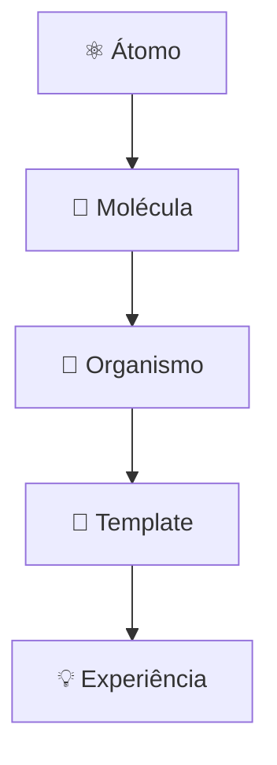

# ⚛️ Arquitetura Atômica (Atomic Architecture)
**Blueprint Fundamental do AI Reusables Framework**

---

## 🧩 Visão Geral

A **Arquitetura Atômica** é o **nível mais essencial** do framework — o ponto de origem onde **lógica, design e cognição** se unem em **unidades mínimas reutilizáveis**.

Inspirada pelo conceito de **Atomic Design** (Brad Frost, 2013), esta abordagem expande o princípio além da interface visual, aplicando-o à **engenharia de IA**, **arquitetura de software** e **estruturação do conhecimento**.

> ⚛️ Cada átomo é um fragmento de inteligência encapsulada.
> Ele não serve apenas para ser reutilizado, mas para ser **combinado, evoluído e reconfigurado**.

---

## 🧠 Conceito Fundamental

Na Arquitetura Atômica, **cada unidade de código, dado, prompt ou design é tratada como uma partícula cognitiva autônoma**, com identidade, função e interface própria.

Esses átomos não formam camadas — formam **fatias vivas**, como **células distribuídas**, capazes de cooperar dentro de um organismo digital.

```

Átomo  →  Molécula  →  Organismo  →  Template  →  Experiência (UX)

```

Cada transição representa uma **emergência de complexidade**, não um acoplamento estrutural.  
O sistema cresce **para fora**, não **para cima**.

---

## 🧬 Blueprint do Átomo

Cada átomo segue um blueprint padrão — simples, isolado e interoperável:

```

atomic/
├── atoms/
│   ├── logic/               # Funções puras e operadores
│   │   ├── normalize_text.py
│   │   └── vector_distance.py
│   ├── prompt_units/        # Fragmentos de prompt (persona, formato, raciocínio)
│   │   ├── persona_expert.yaml
│   │   └── reasoning_chain.yaml
│   ├── data_units/          # Datasets ou trechos de contexto mínimo
│   ├── ui_atoms/            # Componentes básicos de interface (opcional)
│   └── meta.yaml            # Metadados: autor, tipo, entradas, saídas
│
└── examples/
└── use_atomic_logic.py

````

### Exemplo de `meta.yaml`
```yaml
name: normalize_text
type: logic
input: str
output: str
description: Remove acentos, pontuação e padroniza minúsculas.
dependencies: [unicodedata, re]
````

---

## 🧩 Regras de Design Atômico

| Princípio           | Descrição                                           |
| ------------------- | --------------------------------------------------- |
| **Isolamento**      | Cada átomo é autocontido — sem dependência cruzada. |
| **Composição**      | Deve ser combinável com outros sem acoplamento.     |
| **Identidade**      | Possui propósito único e metadado declarativo.      |
| **Escalabilidade**  | Pode ser expandido para moléculas e organismos.     |
| **Reutilização**    | Pode ser importado em qualquer contexto.            |
| **Rastreabilidade** | Possui assinatura de origem e histórico.            |

---

## 💡 Exemplo Prático

### `atoms/logic/normalize_text.py`

```python
import unicodedata, re

def normalize_text(text: str) -> str:
    text = unicodedata.normalize("NFKD", text)
    text = text.encode("ascii", "ignore").decode("utf-8")
    text = re.sub(r"[^a-zA-Z0-9\s]", "", text)
    return text.lower().strip()
```

### `examples/use_atomic_logic.py`

```python
from atoms.logic.normalize_text import normalize_text

raw = "Olá, Mundo! ✨"
clean = normalize_text(raw)
print(clean)  # -> ola mundo
```

Cada átomo como esse pode ser:

* Chamado diretamente por um agente,
* Acoplado em pipelines (como moléculas),
* Ou versionado como unidade de aprendizado.

---

## 🧭 Casos de Uso

| Contexto          | Aplicação                                                      |
| ----------------- | -------------------------------------------------------------- |
| **IA Modular**    | Criar operadores cognitivos básicos (embedder, filter, ranker) |
| **Design System** | Definir elementos primários de UX (botão, label, input)        |
| **DevOps/MLOps**  | Versionar funções e metadados isoladamente (via DVC)           |
| **Educação**      | Ensinar princípios de composição e lógica pura                 |

---

## 🧩 Prompt Base — “Átomo Cognitivo”

```text
Você é um Átomo de Inteligência.
Sua função é executar uma única operação cognitiva com precisão e neutralidade.
Você não raciocina além da sua função, mas entrega sua saída com contexto semanticamente limpo.
```

---

## 🔗 Integração com o Framework

```
atomic/       → base mínima (funções, prompts, dados)
molecular/    → composição de átomos (pipelines, micro-fluxos)
organismic/   → agentes autônomos (AI services, células)
template/     → estrutura aplicacional (frontend/backend)
ux/           → camada viva da experiência (interfaces evolutivas)
```

---

## ⚙️ Requisitos Técnicos

`requirements.txt` (mínimo recomendado):

```
numpy
pandas
pydantic
pyyaml
```

Essas dependências garantem interoperabilidade entre lógica, dados e metadados.

---

## 🧭 Visão Filosófica

> “O átomo é o menor pedaço de razão reutilizável.”

Ele não é um componente fixo, mas um **estado de equilíbrio entre simplicidade e função**.
A inteligência emerge não da sua forma, mas da **sintaxe de suas combinações**.

---

## 🧠 Síntese Visual



Cada nível é uma **nova camada de consciência do sistema**.

---

## 📚 Referências

* Brad Frost — *Atomic Design*, 2013
* Greg Egan — *Permutation City* (conceito de replicação digital)
* Christopher Alexander — *A Pattern Language*
* OpenAI Systems Thinking — *Composable Intelligence Patterns*, 2024

---

> **Versão:** 0.1.0
> **Status:** 🟢 Em desenvolvimento ativo
> **Papel no ecossistema:** DNA do framework — tudo nasce aqui.

```

Assim garantimos continuidade visual, estrutural e conceitual.
```
