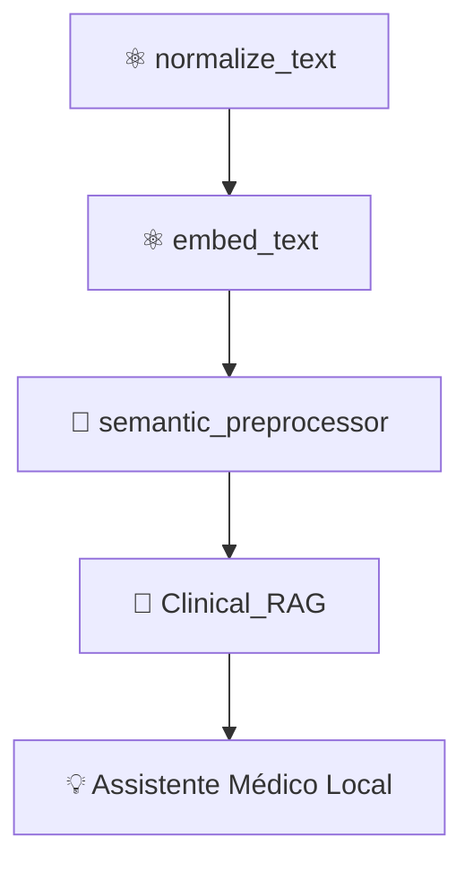

# 🧪 Estudo de Caso: O Nascimento de um Átomo Cognitivo

---

## 🎯 Contexto

Imagine que estamos criando um **assistente médico local** — um pequeno modelo de IA que roda offline, ajudando profissionais de saúde a consultar protocolos e diagnósticos básicos.

Antes de pensar em agentes, UI ou integração com banco de dados, começamos **no nível atômico**:  
definindo **pequenas funções cognitivas autônomas**, reutilizáveis em qualquer fluxo.

---

## ⚛️ O Problema Atômico

Precisamos que o sistema consiga **limpar e normalizar** textos médicos de diferentes fontes:  
PDFs, OCRs e anotações manuais.

Um humano lê “Pneumonia (bactéria)” e entende o conceito —  
mas a IA precisa de um texto limpo, normalizado e padronizado antes de comparar embeddings.

---

## 🧩 O Átomo: `normalize_text`

Esse será o **átomo de normalização semântica**, responsável apenas por limpar texto.  
Nada mais. Ele **não raciocina**, apenas prepara terreno.

### Estrutura
```

atomic/
└── atoms/
├── logic/
│   └── normalize_text.py
└── meta.yaml

````

### `normalize_text.py`
```python
import unicodedata, re

def normalize_text(text: str) -> str:
    """
    Normaliza texto bruto, removendo acentuação, pontuação e espaços extras.
    """
    text = unicodedata.normalize("NFKD", text)
    text = text.encode("ascii", "ignore").decode("utf-8")
    text = re.sub(r"[^a-zA-Z0-9\s]", "", text)
    return text.lower().strip()
````

### `meta.yaml`

```yaml
name: normalize_text
type: logic
input: str
output: str
description: "Remove acentos, pontuação e padroniza minúsculas."
version: 1.0.0
category: preprocessing
tags: [text, normalization, ai-atomic]
author: "AI Reusables Framework"
```

---

## 🧠 Teste do Átomo

```python
from atoms.logic.normalize_text import normalize_text

sample = "Infecção Pulmonar (Pneumonia) 🧬"
print(normalize_text(sample))
# Saída: infeccao pulmonar pneumonia
```

O átomo cumpre sua função.
Ele é simples, previsível, documentado e isolado —
porém, **é o tijolo base** para todas as próximas camadas.

---

## 🔗 Composição: O Átomo em Ação

Agora, outro átomo — `embed_text` — transforma o texto normalizado em vetor.

```python
from sentence_transformers import SentenceTransformer

def embed_text(text: str, model_name="all-MiniLM-L6-v2"):
    model = SentenceTransformer(model_name)
    return model.encode(text)
```

---

## 🧬 Molécula: Combinação de Átomos

A molécula “**SemanticPreprocessor**” nasce da união de dois átomos:

* `normalize_text`
* `embed_text`

```python
from atoms.logic.normalize_text import normalize_text
from atoms.logic.embed_text import embed_text

def semantic_preprocessor(raw_text):
    clean = normalize_text(raw_text)
    vector = embed_text(clean)
    return {"text": clean, "vector": vector}
```

💡 Perceba: o átomo **não é substituído** — ele **é reusado**.
Esse é o ponto-chave da arquitetura atômica: **crescimento por composição**, não por replicação.

---

## 🌱 Do Átomo ao Organismo

Quando dezenas de moléculas (pipelines, agentes, verificadores) cooperam, formamos um **organismo de IA local** —
capaz de:

* receber um texto clínico,
* normalizá-lo,
* vetorizá-lo,
* comparar com uma base embutida,
* e responder offline.

Tudo isso nasceu de um átomo de 10 linhas.

---

## 🧩 Lições do Caso

| Princípio              | Aplicação                                                                   |
| ---------------------- | --------------------------------------------------------------------------- |
| **Simplicidade**       | O átomo não tenta resolver tudo — só sua função mínima.                     |
| **Reusabilidade**      | Pode ser usado por qualquer outro componente, sem dependência.              |
| **Evolutividade**      | Pode ser trocado por outro (ex: `normalize_text_v2`) sem quebrar o sistema. |
| **Interoperabilidade** | Comunica-se via interfaces simples: entrada e saída declaradas.             |

---

## 🧭 Visualizando a Evolução



Cada nível aumenta a **densidade cognitiva**, mas a lógica fundamental permanece:
**átomos autônomos se combinam em inteligência emergente**.

---

## 🌍 Conclusão

A Arquitetura Atômica não é um design de interface —
é um **modelo de pensamento** para construir inteligência de forma modular, orgânica e sustentável.

Ela permite criar **sistemas evolutivos**,
que aprendem e se adaptam sem depender de servidores externos,
porque cada parte é **autocontida e consciente do seu papel**.

---

> **Em uma frase:**
> “Cada átomo é um fragmento de cognição — e cada combinação, uma centelha de consciência.”

---

**Próximo passo:**
🔗 [Arquitetura Molecular (molecular.md)](../molecular.md) →
como combinar múltiplos átomos em fluxos autônomos.

```
