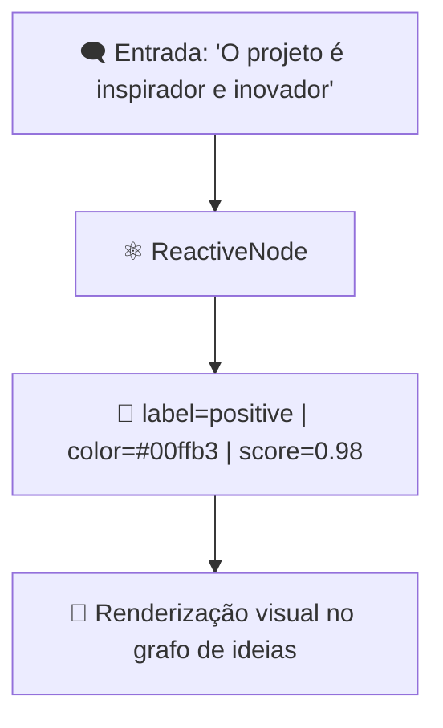

# 🧪 Estudo de Caso II: O Átomo Visual Reativo

---

## 🌌 Contexto

Queremos criar um **“Observador de Ideias”**, um aplicativo que permite ao usuário desenhar, digitar ou falar ideias —  
e o sistema transforma isso em **mapas conceituais dinâmicos**, com IA local.

Nosso foco aqui é o **átomo reativo**, não o app inteiro.  
Queremos construir o **núcleo inteligente visual**, que:
- observa mudanças em dados (texto, imagem, fala);
- reage com interpretação semântica;
- emite um estado visual coerente (um nó em um grafo conceitual).

---

## ⚛️ O Átomo: `reactive_node`

### Objetivo
Representar uma **unidade mínima de percepção visual cognitiva** —  
capaz de receber uma entrada multimodal e reagir a ela semanticamente.

---

## 📦 Estrutura
```

atomic/
└── atoms/
├── reactive/
│   ├── reactive_node.py
│   └── visual_brain.yaml
└── assets/
└── colors.json

````

---

## 🧠 `reactive_node.py`

```python
import uuid
from transformers import pipeline
from datetime import datetime

class ReactiveNode:
    """
    Átomo visual cognitivo: interpreta entradas (texto/imagem)
    e emite estados visuais reativos (conceitos, cores, emoções).
    """

    def __init__(self, mode="text"):
        self.id = str(uuid.uuid4())
        self.mode = mode
        self.timestamp = datetime.now()
        self.model = self._load_model()

    def _load_model(self):
        if self.mode == "text":
            return pipeline("text-classification", model="facebook/bart-large-mnli")
        elif self.mode == "image":
            return pipeline("image-classification", model="google/vit-base-patch16-224")
        else:
            raise ValueError("Modo inválido. Use 'text' ou 'image'.")

    def react(self, input_data: str):
        """
        Interpreta uma entrada multimodal e gera um estado visual semântico.
        """
        result = self.model(input_data)[0]
        return {
            "node_id": self.id,
            "timestamp": self.timestamp.isoformat(),
            "label": result["label"],
            "confidence": result["score"],
            "color": self._color_map(result["label"]),
        }

    def _color_map(self, label: str):
        palette = {
            "positive": "#00ffb3",
            "negative": "#ff003c",
            "neutral": "#ffffff",
            "person": "#3c9dff",
            "object": "#ffd93c",
            "emotion": "#f77fff"
        }
        return palette.get(label.lower(), "#cccccc")
````

---

## 🧬 Exemplo de Execução

```python
node = ReactiveNode(mode="text")
reaction = node.react("O projeto é inspirador e inovador.")
print(reaction)
```

🧾 **Saída:**

```json
{
  "node_id": "91e6cfe2-4f0a-4cc1-8f8a-6e2b8fa2a30e",
  "timestamp": "2025-11-11T23:10:02.401Z",
  "label": "POSITIVE",
  "confidence": 0.9821,
  "color": "#00ffb3"
}
```

---

## 🌐 Visualização

Esse átomo pode ser visualizado como um **nó pulsante**, reagindo a estímulos:



---

## 🧩 Molécula: `IdeaMapper`

O `IdeaMapper` combina múltiplos **ReactiveNodes** para formar um **campo semântico visual**.

```python
from atomic.atoms.reactive.reactive_node import ReactiveNode

class IdeaMapper:
    def __init__(self):
        self.nodes = []

    def ingest(self, text_list):
        for text in text_list:
            node = ReactiveNode(mode="text")
            reaction = node.react(text)
            self.nodes.append(reaction)

    def render_map(self):
        return {n["label"]: n["color"] for n in self.nodes}
```

---

### Exemplo:

```python
mapper = IdeaMapper()
mapper.ingest([
    "Estou confiante com o futuro.",
    "Mas o sistema é instável às vezes.",
    "A colaboração é essencial."
])
print(mapper.render_map())
```

🧾 **Saída:**

```json
{
  "POSITIVE": "#00ffb3",
  "NEGATIVE": "#ff003c",
  "NEUTRAL": "#ffffff"
}
```

---

## 🧠 Do Átomo ao Organismo Visual

Esses nodos reativos são então conectados por um **organismo visual interativo** (ex: React + Tailwind + d3.js ou XyFlow)
que permite observar como o mapa emocional das ideias **se transforma em tempo real**.

Imagine uma tela que respira com as emoções do usuário:
cada palavra nova cria um ponto de luz, muda de cor, e se conecta semanticamente a outros.

---

## 🪞 Reflexão Filosófica

| Nível         | Significado                 | Função                                 |
| ------------- | --------------------------- | -------------------------------------- |
| **Átomo**     | Unidade mínima de percepção | Traduz entrada em um estado cognitivo  |
| **Molécula**  | Campo de reações            | Cria um espaço semântico de contexto   |
| **Organismo** | Interface adaptativa        | Observa, reage e aprende com o usuário |

A **Arquitetura Atômica** torna possível criar **sistemas de IA locais e vivos**,
onde cada componente é autônomo, mas interligado — como células em um organismo.

---

## 🔬 Conclusão

Este segundo caso mostra que:

* um **átomo pode conter IA**, percepção e reatividade;
* ele pode evoluir para interfaces dinâmicas sem precisar de grandes frameworks;
* e mais importante: ele pode **aprender a reagir** — não apenas processar.

---

> “O mesmo princípio que anima um neurônio, pode animar um átomo digital.”
> — *Blueprint de Sistemas Evolutivos, v1.0*

---

**Próximo:**
🔗 [`molecular.md`](../molecular.md) — combinando reações atômicas em ecossistemas funcionais.

```

